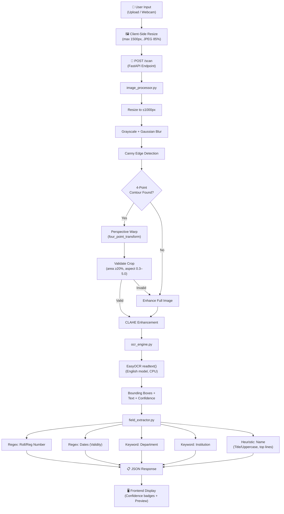

<p align="center">
  <h1 align="center">🪪 IntelliScan AI</h1>
  <p align="center">
    <strong>AI-Powered ID Card Scanner & Data Extraction System</strong>
  </p>
  <p align="center">
    A production-ready full-stack application that automatically detects ID cards, extracts text using OCR, and intelligently parses structured fields — all from a single image upload.
  </p>
  <p align="center">
    
    
    
    
    
  </p>
</p>

---

## ✨ Features

- **📸 Dual Input** — Upload an image or capture directly via webcam
- **🔍 Auto-Detection** — Detects and crops the ID card using contour-based computer vision
- **📝 OCR Extraction** — Extracts all visible text using EasyOCR deep learning models
- **🧠 Smart Parsing** — Intelligently identifies Name, Roll Number, Department, Institution, and Validity using regex + heuristics
- **📊 Confidence Scores** — Each extracted field includes a confidence rating
- **📥 JSON Export** — Download structured extraction results as JSON
- **⚡ Client-Side Optimization** — Images are resized on the browser before upload for faster processing
- **🐳 Docker Ready** — Single Dockerfile for containerized deployment

---

## 🏗️ Architecture

### System Overview

```
┌─────────────────────────────────────────────────────────────────┐
│                        FastAPI Server (:8000)                   │
│                                                                 │
│  ┌──────────────┐    ┌──────────────────────────────────────┐   │
│  │   Frontend    │    │           REST API                   │   │
│  │              │    │                                      │   │
│  │  /static/    │    │  POST /scan    → ID card pipeline    │   │
│  │   style.css  │    │  GET  /health  → Health check        │   │
│  │   app.js     │    │  GET  /docs    → Swagger UI          │   │
│  │              │    │                                      │   │
│  │  /templates/ │    └──────────────────────────────────────┘   │
│  │   index.html │                                               │
│  └──────────────┘                                               │
└─────────────────────────────────────────────────────────────────┘
```

### Processing Pipeline

The core AI pipeline transforms a raw image into structured data through 3 stages:

```
┌──────────┐     ┌──────────────────┐     ┌────────────┐     ┌──────────────────┐
│  Upload  │────▶│  Image Processing│────▶│  OCR Engine│────▶│ Field Extraction │
│  Image   │     │  (OpenCV)        │     │  (EasyOCR) │     │ (Regex+Heuristic)│
└──────────┘     └──────────────────┘     └────────────┘     └──────────────────┘
                        │                       │                      │
                        ▼                       ▼                      ▼
                  • Contour detection     • Text detection       • Name
                  • Perspective warp      • Bounding boxes       • Roll Number
                  • CLAHE enhancement     • Confidence scores    • Department
                  • Grayscale convert     • Raw text output      • Institution
                                                                 • Validity
```

### Detailed Component Breakdown



---

## 📁 Project Structure

```
intelliscan-ai/
├── backend/
│   ├── __init__.py              # Package initializer
│   ├── main.py                  # FastAPI app, routes, static/template config
│   ├── image_processor.py       # OpenCV: detection, cropping, enhancement
│   ├── ocr_engine.py            # EasyOCR: text extraction
│   ├── field_extractor.py       # Regex + heuristics: structured field parsing
│   ├── templates/
│   │   └── index.html           # Main UI (Jinja2 template)
│   └── static/
│       ├── style.css            # Dark theme, glassmorphism UI styles
│       └── app.js               # Frontend logic: upload, webcam, API calls
├── requirements.txt             # Python dependencies
├── Dockerfile                   # Production container definition
├── .dockerignore                # Excludes .venv, __pycache__, .git from build
└── README.md
```

---

## 🚀 Getting Started

### Prerequisites

- **Python 3.11+**
- **pip** package manager

### Local Development

```bash
# 1. Clone the repository
git clone https://github.com/Prasaanth02/id_card_scanner.git
cd id_card_scanner

# 2. Create and activate virtual environment
python -m venv .venv
.venv\Scripts\activate        # Windows
# source .venv/bin/activate   # macOS/Linux

# 3. Install dependencies
pip install -r requirements.txt

# 4. Start the server
uvicorn backend.main:app --reload --port 8000
```

Open **http://localhost:8000** — the full application (UI + API) is served from a single origin.

### Docker Deployment

```bash
# Build the image
docker build -t intelliscan-ai .

# Run the container
docker run -p 8000:8000 intelliscan-ai
```

---

## 🔌 API Reference

### `POST /scan`

Upload an ID card image for processing.

| Parameter | Type       | Description          |
|-----------|------------|----------------------|
| `file`    | `UploadFile` | Image file (JPEG/PNG) |

**Response:**
```json
{
  "name": "JOHN DOE",
  "roll_number": "21CS045",
  "validity": "31/05/2025",
  "department": "Computer Science Engineering",
  "institution": "ABC College of Engineering",
  "raw_text": "Full OCR text...",
  "confidence_scores": {
    "name": 0.70,
    "roll_number": 0.95,
    "validity": 0.85,
    "department": 0.85,
    "institution": 0.90
  },
  "was_cropped": true,
  "preview_image_base64": "data:image/jpeg;base64,..."
}
```

### `GET /health`

Health check endpoint. Returns `{"status": "ok"}`.

### `GET /docs`

Interactive Swagger UI for API testing.

---

## 🛠️ Tech Stack

| Layer         | Technology | Purpose                                     |
|---------------|------------|---------------------------------------------|
| **Backend**   | FastAPI    | Async web framework, auto-generated API docs |
| **OCR**       | EasyOCR    | Deep learning-based text recognition         |
| **Vision**    | OpenCV     | Image processing, contour detection, transforms |
| **Frontend**  | Vanilla JS | Drag-and-drop upload, webcam, dynamic UI     |
| **Styling**   | CSS3       | Dark theme with glassmorphism effects        |
| **Serving**   | Uvicorn    | ASGI server for production                   |
| **Container** | Docker     | Reproducible deployment                      |

---

## 📄 License

This project is open source and available under the [MIT License](LICENSE).
